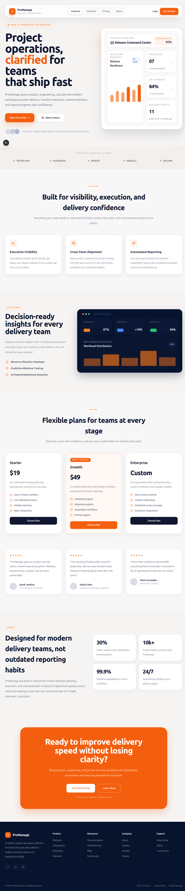
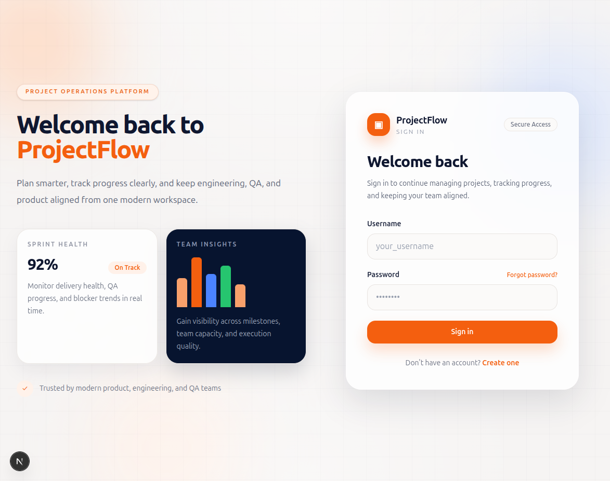
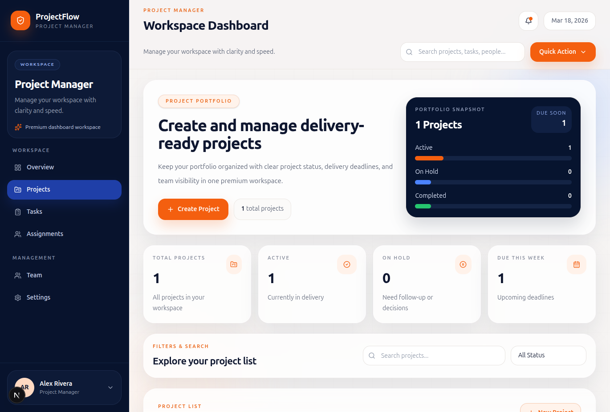
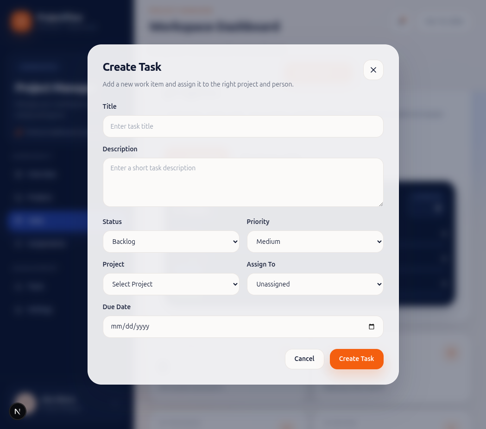

# Project Management System (Django + Next.js)

A role-based **Project Management Application** built with **Django REST Framework** as the backend and **Next.js** as the frontend.
The system manages projects, tasks, bugs, and QA workflows using **JWT-based authentication** and strict role-based permissions.

This project was implemented within a limited timeframe with a strong focus on **architecture, correctness, and scalability**. The current implementation is intentionally minimal but production-ready, with a clear path for future enhancements.

---

# Dashboard


# Login Page


# PM Portal


# Task Creation Form



## 🚀 Tech Stack

### Backend

* Django
* Django REST Framework (DRF)
* JWT Authentication (SimpleJWT)
* SQLite / PostgreSQL (configurable)
* Role-based permissions

### Frontend

* Next.js (App Router)
* TypeScript
* Fetch API
* Modular component-based UI

---

## 🔐 Authentication & Authorization

* User Sign Up / Login
* JWT-based authentication
* Token verification for protected routes
* Role-based access using Django permissions and groups

---

## 👥 User Roles & Capabilities

### 🧑‍💼 Project Manager (PM)

* Create and manage projects
* Assign Developers and QA to projects
* Create tasks and assign them to Developers
* View project-level task and bug data

### 👨‍💻 Developer

* View assigned projects
* View tasks assigned to them
* Track task status and progress
* Isolated access (cannot see unrelated projects or tasks)

### 🧪 QA Engineer

* View projects where QA is assigned
* Report bugs for assigned projects
* View bugs requiring verification
* View test runs (basic implementation)

---

## 🗂 Core Features

### Projects

* Created and owned by Project Managers
* Developer and QA assignment per project
* Strict permission enforcement

### Tasks

* Created by PMs
* Assigned to Developers
* Developer-only task visibility
* Status and priority tracking

### Bugs

* QA can report bugs only for assigned projects
* Bug fields include:

  * Title
  * Description
  * Severity
  * Status
  * Project
* Clear lifecycle separation (reporting vs verification)

### Test Runs

* QA-focused test run listing
* Designed for future test case management

---

## 🧠 Architectural Highlights

* Role-based API endpoints (PM / Dev / QA)
* Serializer-driven responses
* Domain separation (`projects`, `tasks`, `bugs`, `auth`)
* Frontend types aligned with backend serializers
* Designed for extension, not over-engineering

---


## 📦 API Structure (High-Level)

```text
/api/auth/
  ├── login/
  ├── register/

/api/projects/
  ├── pm/
  ├── qa/

/api/tasks/
  ├── dev/

/api/bugs/
  ├── create/
  ├── qa/
  ├── pm/
  ├── dev/
```

---

## ▶️ Running the Project Locally

### 🔧 Backend Setup (Django)

#### 1. Clone the repository

```bash
git clone https://github.com/your-username/project-management-app.git
cd project-management-app/backend
```

#### 2. Create and activate virtual environment

```bash
python3 -m venv venv
source venv/bin/activate
```

(Windows)

```bash
venv\Scripts\activate
```

#### 3. Install dependencies

```bash
pip install -r requirements.txt
```

#### 4. Apply database migrations

```bash
python manage.py makemigrations
python manage.py migrate
```

#### 5. Create superuser (optional)

```bash
python manage.py createsuperuser
```

#### 6. Run the development server

```bash
python manage.py runserver
```

Backend will be available at:

```
http://localhost:8000/
```

---

### 🌐 Frontend Setup (Next.js)

```bash
cd frontend
npm install
npm run dev
```

Frontend will be available at:

```
http://localhost:3000/
```

---

## 🧪 Testing & Validation

* APIs tested using Postman
* JWT and permission checks validated
* Error handling for unauthorized access
* Defensive serializer validation

---

## ⚠️ Scope & Future Enhancements

This project was built under time constraints with focus on **clean backend design and correctness** rather than feature volume.

Planned enhancements include:

* Task comments and activity logs
* Bug lifecycle actions (assign, verify, close)
* Test case management
* File attachments (screenshots, PR links)
* Pagination and advanced filtering
* Audit trails and notifications

---

## 📌 Why This Project Matters

This repository demonstrates:

* Practical Django REST Framework expertise
* Secure JWT-based authentication
* Clean role-based backend architecture
* Strong API contract discipline
* Ability to deliver production-quality systems under time constraints

---
